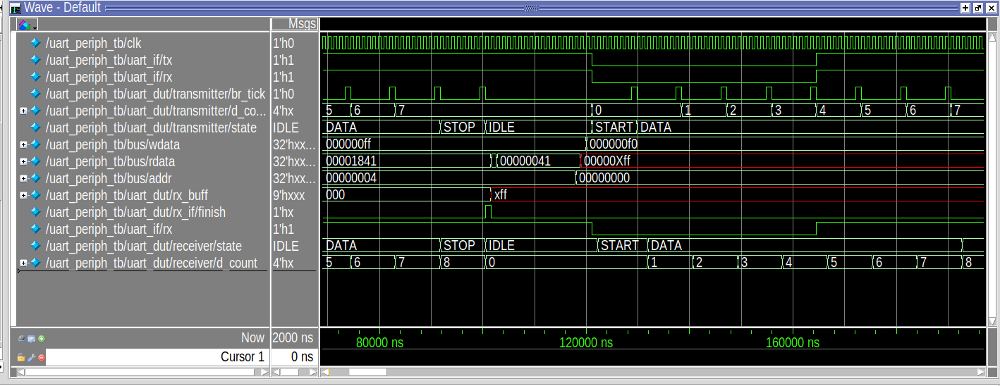

# Memory-Mapped UART Controller

This project implements a UART (Universal Asynchronous Receiver/Transmitter) with a memory-mapped interface, suitable for digital design and embedded systems applications.

## Features

- **UART Transmitter and Receiver**: Supports standard UART communication.
- **Memory-Mapped Registers**: Easy integration with microcontrollers or processors.
- **Configurable Baud Rate**: Set baud rate as per application requirements.
- **Status and Control Register**: For efficient data handling and error detection.

## Directory Structure

```
UART_mem_mapped/
├── rtl/           # Source code (Verilog/VHDL)
├── tb/            # Simulation files and testbenches
└── README.md      # Project overview
```

## Getting Started

1. Clone the repository.
2. Review the `rtl/` directory for HDL source files.
3. Use the provided testbenches in `tb/` to verify functionality.


## Interface
---------
- Clock frequency: 921600 Hz  
- Reset: Synchronous  
 
## Register Map
------------
Data Register (DR)
- Address: 0x00
- Width: 9 bits
- Access: Read (R), Write (W), Read/Write (RW)

Control Register (CR)
- Address: 0x04
- Width: 14 bits  
- Access: Read (R), Write (W), Read/Write (RW)

| Bit(s) | Name     | Access | Description                              |
|--------|----------|--------|------------------------------------------|
| 13     | txf      | R      | Transmit buffer full flag                |
| 12     | rxe      | R      | Receive buffer empty flag                |
| 11:3   | br_div   | RW     | Baud rate divider                        |
| 2      | word     | RW     | Data word length: 0 = 8 bits, 1 = 9 bits |
| 1      | stop     | RW     | Stop bit select: 0 = 1 bit, 1 = 2 bits   |
| 0      | en       | RW     | UART enable: 0 = disabled, 1 = enabled   |


### Notes

- Ensure en is set before attempting communication.
- Configure br_div, word, and stop appropriately during initialization.
- txf and rxe are status flags and should be polled or monitored before read/write operations.

## Usage

Integrate the UART module into your FPGA or ASIC design. Connect the memory-mapped interface to your system bus for easy access to UART registers.



## License

This project is licensed under the GPL 2.0 License. See the LICENSE file for details.